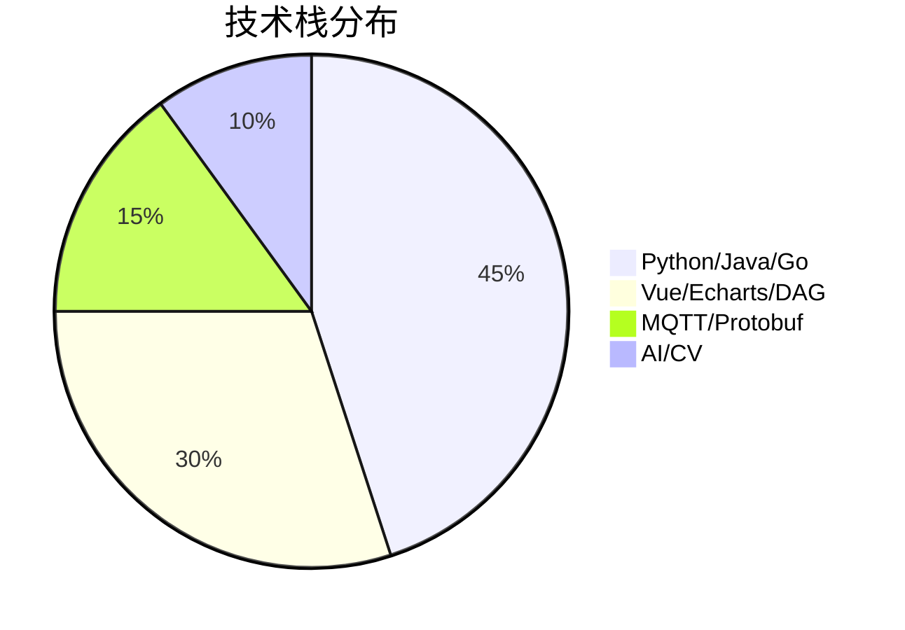

```markdown

```bash
# 每日开机自检
$ ./jyuq --status
🧠 思维模块: 已加载 | ☕ 咖啡浓度: 87% | 🐛 待处理BUG: 42
```
## 🛠️ 技术军火库


```mermaid
pie
    title 技术栈分布
    "Python/Java/Go" : 45
    "Vue/Echarts/DAG" : 30
    "MQTT/Protobuf" : 15
    "AI/CV" : 10
```
```
