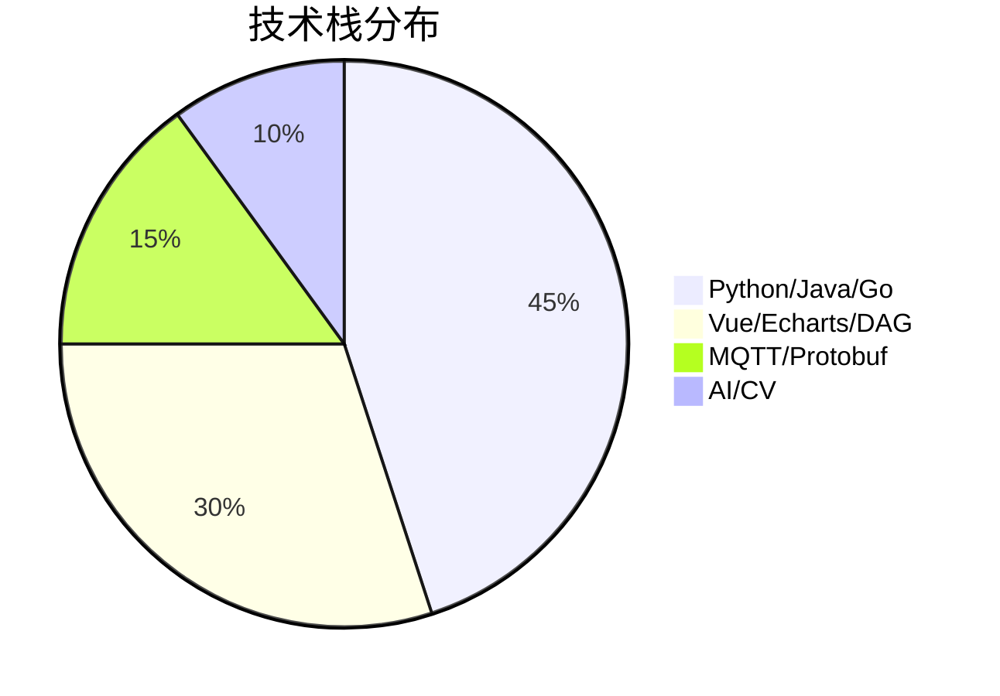
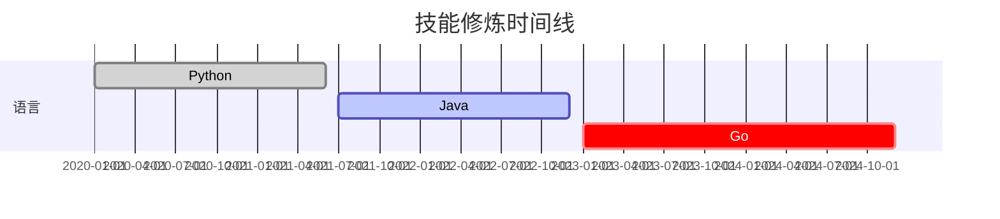

```markdown
# 🤖 究极自动机 · Jyuq 


```bash
# 每日开机自检
$ ./jyuq --status
🧠 思维模块: 已加载 | ☕ 咖啡浓度: 87% | 🐛 待处理BUG: 42
```

## 🛠️ 技术军火库



## 🚀 代表作（幻想版）

```python
class 物联网泡面机:
    def 自动烹饪(self):
        while True:
            水量 = self.读取传感器()
            if 水量 < 0.5:
                self.发送MQTT告警("水太少，加点眼泪吧💧")
            else:
                self.启动加热(使用算法='大语言模型调参法')
```

## 🔥 实时数据看板

[](https://git.io/streak-stats)


## 🧩 技术拼图

```markdown
| 领域         | 技术栈                        | 熟练度  |
|--------------|------------------------------|---------|
| 后端开发     | Python, Java, Go              | ⬛⬛⬛⬛⬜ |
| 前端开发     | Vue3, Echarts, DAG            | ⬛⬛⬛⬜⬜ |
| 物联网       | MQTT, Protobuf, 二进制协议     | ⬛⬛⬛⬜⬜ |
| AI/ML        | LLM, OpenCV, GAN              | ⬛⬛⬜⬜⬜ |
```

## 📜 代码哲学

```go
package main

import "fmt"

func 人生() {
    for {
        努力 := coding()
        if 努力.报酬率 < 0.1 {
            fmt.Println("换个姿势继续卷！")
        } else {
            fmt.Println("BUG改完了？不存在的！")
        }
    }
}
```

## 📡 通信协议实验室

```protobuf
syntax = "proto3";

message 咖啡机状态 {
  bool 是否煮沸 = 1;
  float 咖啡因浓度 = 2;
  string 当前播放歌曲 = 3 [default = "《卡农》Remix版"];
}

// MQTT主题设计规范
topic/coffee/{room}/status → "茶水间咖啡机正在播放《野狼Disco》"
```

## 🎮 技能树进化史



## 📬 捕捉方式

```markdown
[](mailto:your_email@example.com)
[](https://leetcode.com/yourprofile)
```

<details>
<summary>🎁 点击展开隐藏彩蛋</summary>

```javascript
// 防秃头算法（测试版）
function 保护发际线() {
  setInterval(() => {
    document.querySelectorAll('bug').forEach(bug => {
      bug.fix().then(头发 => 头发.grow(0.0001))
    })
  }, 1000 * 60 * 60 * 24) // 每天执行一次
}
```
</details>

